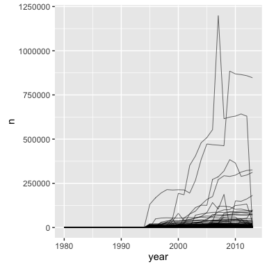
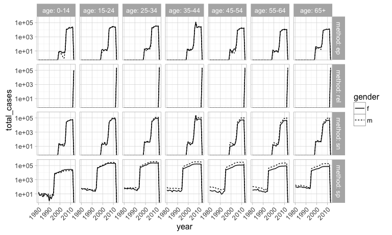

tidyverse
================
Michael Levy, Prepared for the Davis R-Users' Group
October 13, 2016

What is the tidyverse?
----------------------

~~Hadleyverse~~

The tidyverse is a suite of R tools that follow a tidy philosophy:

### Tidy data

Put data in data frames

-   Each type of observation gets a data frame
-   Each variable gets a column
-   Each observation gets a row

### Tidy APIs

Functions should be consistent and easily (human) readable

-   Take one step at a time
-   Connect simple steps with the pipe
-   Referential transparency

### Okay but really, what is it?

Suite of ~20 packages that provide consistent, user-friendly, smart-default tools to do most of what most people do in R.

-   Core packages: ggplot2, dplyr, tidyr, readr, purrr, tibble
-   Specialized data manipulation: hms, stringr, lubridate, forcats
-   Data import: DBI, haven, httr, jsonlite, readxl, rvest, xml2
-   Modeling: modelr, broom

`install.packages(tidyverse)` installs all of the above packages.

`library(tidyverse)` attaches only the core packages.

Why tidyverse?
--------------

-   Consistency
    -   e.g. All `stringr` functions take string first
    -   e.g. Many functions take data.frame first -&gt; piping
        -   Faster to write
        -   Easier to read
    -   Tidy data: Imposes good practices
    -   Type specificity
-   You probably use some of it already. Synergize.
-   Implements simple solutions to common problems (e.g. `purrr::transpose`)
-   Smarter defaults
    -   e.g. `utils::write.csv(row.names = FALSE)` = `readr::write_csv()`
-   Runs fast (thanks to `Rcpp`)
-   Interfaces well with other tools (e.g. Spark with `dplyr` via `sparklyr`)

`tibble`
--------

> A modern reimagining of data frames.

``` r
library(tidyverse)
```

    ## Warning: package 'tidyverse' was built under R version 3.2.5

    ## Loading tidyverse: ggplot2
    ## Loading tidyverse: tibble
    ## Loading tidyverse: tidyr
    ## Loading tidyverse: readr
    ## Loading tidyverse: purrr
    ## Loading tidyverse: dplyr

    ## Warning: package 'ggplot2' was built under R version 3.2.4

    ## Warning: package 'tibble' was built under R version 3.2.5

    ## Warning: package 'tidyr' was built under R version 3.2.5

    ## Warning: package 'readr' was built under R version 3.2.5

    ## Warning: package 'purrr' was built under R version 3.2.5

    ## Warning: package 'dplyr' was built under R version 3.2.5

    ## Conflicts with tidy packages ----------------------------------------------

    ## filter(): dplyr, stats
    ## lag():    dplyr, stats

``` r
tdf = tibble(x = 1:1e4, y = rnorm(1e4))  # == data_frame(x = 1:1e4, y = rnorm(1e4))
class(tdf)
```

    ## [1] "tbl_df"     "tbl"        "data.frame"

Tibbles print politely.

``` r
tdf
```

    ## # A tibble: 10,000 × 2
    ##        x          y
    ##    <int>      <dbl>
    ## 1      1 -0.3925671
    ## 2      2  0.1703861
    ## 3      3  0.4583199
    ## 4      4 -1.2424335
    ## 5      5 -1.1806229
    ## 6      6  0.2770036
    ## 7      7 -1.1615956
    ## 8      8  1.1410134
    ## 9      9  0.0126514
    ## 10    10  0.1164728
    ## # ... with 9,990 more rows

-   Can customize print methods with `print(tdf, n = rows, width = cols)`

-   Set default with `options(tibble.print_max = rows, tibble.width = cols)`

Tibbles have some convenient and consistent defaults that are different from base R data.frames.

#### strings as factors

``` r
dfs = list(
  df = data.frame(abc = letters[1:3], xyz = letters[24:26]),
  tbl = data_frame(abc = letters[1:3], xyz = letters[24:26])
)
sapply(dfs, function(d) class(d$abc))
```

    ##          df         tbl 
    ##    "factor" "character"

#### partial matching of names

``` r
sapply(dfs, function(d) d$a)
```

    ## Warning: Unknown column 'a'

    ## $df
    ## [1] a b c
    ## Levels: a b c
    ## 
    ## $tbl
    ## NULL

#### type consistency

``` r
sapply(dfs, function(d) class(d[, "abc"]))
```

    ## $df
    ## [1] "factor"
    ## 
    ## $tbl
    ## [1] "tbl_df"     "tbl"        "data.frame"

Note that tidyverse import functions (e.g. `readr::read_csv`) default to tibbles and that *this can break existing code*.

#### List-columns!

``` r
tibble(ints = 1:5,
       powers = lapply(1:5, function(x) x^(1:x)))
```

    ## # A tibble: 5 × 2
    ##    ints    powers
    ##   <int>    <list>
    ## 1     1 <dbl [1]>
    ## 2     2 <dbl [2]>
    ## 3     3 <dbl [3]>
    ## 4     4 <dbl [4]>
    ## 5     5 <dbl [5]>

The pipe `%>%`
--------------

Sends the output of the LHS function to the first argument of the RHS function.

``` r
sum(1:8) %>%
  sqrt()
```

    ## [1] 6

`dplyr`
-------

Common data(frame) manipulation tasks.

Four core "verbs": filter, select, arrange, group\_by + summarize, plus many more convenience functions.

``` r
library(ggplot2movies)
```

    ## Error in library(ggplot2movies): there is no package called 'ggplot2movies'

``` r
str(movies)
```

    ## Error in str(movies): object 'movies' not found

``` r
filter(movies, length > 360)
```

    ## Error in filter_(.data, .dots = lazyeval::lazy_dots(...)): object 'movies' not found

``` r
filter(movies, length > 360) %>%
  select(title, rating, votes)
```

    ## Error in filter_(.data, .dots = lazyeval::lazy_dots(...)): object 'movies' not found

``` r
filter(movies, Animation == 1, votes > 1000) %>%
  select(title, rating) %>%
  arrange(desc(rating))
```

    ## Error in filter_(.data, .dots = lazyeval::lazy_dots(...)): object 'movies' not found

`summarize` makes `aggregate` and `tapply` functionality easier, and the output is always a data frame.

``` r
filter(movies, mpaa != "") %>%
  group_by(year, mpaa) %>%
  summarize(avg_budget = mean(budget, na.rm = TRUE),
            avg_rating = mean(rating, na.rm = TRUE)) %>%
  arrange(desc(year), mpaa)
```

    ## Error in filter_(.data, .dots = lazyeval::lazy_dots(...)): object 'movies' not found

`count` for frequency tables. Note the consistent API and easy readability vs. `table`.

``` r
filter(movies, mpaa != "") %>%
  count(year, mpaa, Animation, sort = TRUE)
```

    ## Error in filter_(.data, .dots = lazyeval::lazy_dots(...)): object 'movies' not found

``` r
basetab = with(movies[movies$mpaa != "", ], table(year, mpaa, Animation))
```

    ## Error in with(movies[movies$mpaa != "", ], table(year, mpaa, Animation)): object 'movies' not found

``` r
basetab[1:5, , ]
```

    ## Error in eval(expr, envir, enclos): object 'basetab' not found

### joins

`dplyr` also does multi-table joins and can connect to various types of databases.

``` r
t1 = data_frame(alpha = letters[1:6], num = 1:6)
t2 = data_frame(alpha = letters[4:10], num = 4:10)
full_join(t1, t2, by = "alpha", suffix = c("_t1", "_t2"))
```

    ## # A tibble: 10 × 3
    ##    alpha num_t1 num_t2
    ##    <chr>  <int>  <int>
    ## 1      a      1     NA
    ## 2      b      2     NA
    ## 3      c      3     NA
    ## 4      d      4      4
    ## 5      e      5      5
    ## 6      f      6      6
    ## 7      g     NA      7
    ## 8      h     NA      8
    ## 9      i     NA      9
    ## 10     j     NA     10

Super-secret pro-tip: You can `group_by` %&gt;% `mutate` to accomplish a summarize + join

``` r
data_frame(group = sample(letters[1:3], 10, replace = TRUE),
           value = rnorm(10)) %>%
  group_by(group) %>%
  mutate(group_average = mean(value))
```

    ## Source: local data frame [10 x 3]
    ## Groups: group [3]
    ## 
    ##    group        value group_average
    ##    <chr>        <dbl>         <dbl>
    ## 1      a -0.053153527   0.604539161
    ## 2      b  0.151062399   0.063660081
    ## 3      a  0.044527046   0.604539161
    ## 4      a  0.477646082   0.604539161
    ## 5      c  0.009075314   0.009075314
    ## 6      a  1.949137041   0.604539161
    ## 7      b -0.533904171   0.063660081
    ## 8      b -0.419352794   0.063660081
    ## 9      b  0.433994233   0.063660081
    ## 10     b  0.686500737   0.063660081

`tidyr`
-------

Latest generation of `reshape`. `gather` to make wide table long, `spread` to make long tables wide.

``` r
who  # Tuberculosis data from the WHO
```

    ## # A tibble: 7,240 × 60
    ##        country  iso2  iso3  year new_sp_m014 new_sp_m1524 new_sp_m2534
    ##          <chr> <chr> <chr> <int>       <int>        <int>        <int>
    ## 1  Afghanistan    AF   AFG  1980          NA           NA           NA
    ## 2  Afghanistan    AF   AFG  1981          NA           NA           NA
    ## 3  Afghanistan    AF   AFG  1982          NA           NA           NA
    ## 4  Afghanistan    AF   AFG  1983          NA           NA           NA
    ## 5  Afghanistan    AF   AFG  1984          NA           NA           NA
    ## 6  Afghanistan    AF   AFG  1985          NA           NA           NA
    ## 7  Afghanistan    AF   AFG  1986          NA           NA           NA
    ## 8  Afghanistan    AF   AFG  1987          NA           NA           NA
    ## 9  Afghanistan    AF   AFG  1988          NA           NA           NA
    ## 10 Afghanistan    AF   AFG  1989          NA           NA           NA
    ## # ... with 7,230 more rows, and 53 more variables: new_sp_m3544 <int>,
    ## #   new_sp_m4554 <int>, new_sp_m5564 <int>, new_sp_m65 <int>,
    ## #   new_sp_f014 <int>, new_sp_f1524 <int>, new_sp_f2534 <int>,
    ## #   new_sp_f3544 <int>, new_sp_f4554 <int>, new_sp_f5564 <int>,
    ## #   new_sp_f65 <int>, new_sn_m014 <int>, new_sn_m1524 <int>,
    ## #   new_sn_m2534 <int>, new_sn_m3544 <int>, new_sn_m4554 <int>,
    ## #   new_sn_m5564 <int>, new_sn_m65 <int>, new_sn_f014 <int>,
    ## #   new_sn_f1524 <int>, new_sn_f2534 <int>, new_sn_f3544 <int>,
    ## #   new_sn_f4554 <int>, new_sn_f5564 <int>, new_sn_f65 <int>,
    ## #   new_ep_m014 <int>, new_ep_m1524 <int>, new_ep_m2534 <int>,
    ## #   new_ep_m3544 <int>, new_ep_m4554 <int>, new_ep_m5564 <int>,
    ## #   new_ep_m65 <int>, new_ep_f014 <int>, new_ep_f1524 <int>,
    ## #   new_ep_f2534 <int>, new_ep_f3544 <int>, new_ep_f4554 <int>,
    ## #   new_ep_f5564 <int>, new_ep_f65 <int>, newrel_m014 <int>,
    ## #   newrel_m1524 <int>, newrel_m2534 <int>, newrel_m3544 <int>,
    ## #   newrel_m4554 <int>, newrel_m5564 <int>, newrel_m65 <int>,
    ## #   newrel_f014 <int>, newrel_f1524 <int>, newrel_f2534 <int>,
    ## #   newrel_f3544 <int>, newrel_f4554 <int>, newrel_f5564 <int>,
    ## #   newrel_f65 <int>

``` r
who %>%
  gather(group, cases, -country, -iso2, -iso3, -year)
```

    ## # A tibble: 405,440 × 6
    ##        country  iso2  iso3  year       group cases
    ##          <chr> <chr> <chr> <int>       <chr> <int>
    ## 1  Afghanistan    AF   AFG  1980 new_sp_m014    NA
    ## 2  Afghanistan    AF   AFG  1981 new_sp_m014    NA
    ## 3  Afghanistan    AF   AFG  1982 new_sp_m014    NA
    ## 4  Afghanistan    AF   AFG  1983 new_sp_m014    NA
    ## 5  Afghanistan    AF   AFG  1984 new_sp_m014    NA
    ## 6  Afghanistan    AF   AFG  1985 new_sp_m014    NA
    ## 7  Afghanistan    AF   AFG  1986 new_sp_m014    NA
    ## 8  Afghanistan    AF   AFG  1987 new_sp_m014    NA
    ## 9  Afghanistan    AF   AFG  1988 new_sp_m014    NA
    ## 10 Afghanistan    AF   AFG  1989 new_sp_m014    NA
    ## # ... with 405,430 more rows

`ggplot2`
---------

If you don't already know and love it, check out [one of](https://d-rug.github.io/blog/2012/ggplot-introduction) [our](https://d-rug.github.io/blog/2013/xtsmarkdown) [previous](https://d-rug.github.io/blog/2013/formatting-plots-for-pubs) [talks](https://d-rug.github.io/blog/2015/ggplot-tutorial-johnston) on ggplot or any of the excellent resources on the internet.

Note that the pipe and consistent API make it easy to combine functions from different packages, and the whole thing is quite readable.

``` r
who %>%
  select(-iso2, -iso3) %>%
  gather(group, cases, -country, -year) %>%
  count(country, year, wt = cases) %>%
  ggplot(aes(x = year, y = n, group = country)) +
  geom_line(size = .2) 
```



`readr`
-------

For reading flat files. Faster than base with smarter defaults.

``` r
bigdf = data_frame(int = 1:1e6, 
                   squares = int^2, 
                   letters = sample(letters, 1e6, replace = TRUE))
```

``` r
system.time(
  write.csv(bigdf, "base-write.csv")
)
```

    ##    user  system elapsed 
    ##   3.033   0.104   3.220

``` r
system.time(
  write_csv(bigdf, "readr-write.csv")
)
```

    ##    user  system elapsed 
    ##   0.953   0.072   1.100

``` r
read.csv("base-write.csv", nrows = 3)
```

    ##   X int squares letters
    ## 1 1   1       1       x
    ## 2 2   2       4       f
    ## 3 3   3       9       p

``` r
read_csv("readr-write.csv", n_max = 3)
```

    ## Parsed with column specification:
    ## cols(
    ##   int = col_integer(),
    ##   squares = col_double(),
    ##   letters = col_character()
    ## )

    ## # A tibble: 3 × 3
    ##     int squares letters
    ##   <int>   <dbl>   <chr>
    ## 1     1       1       x
    ## 2     2       4       f
    ## 3     3       9       p

`broom`
-------

`broom` is a convenient little package to work with model results. Two functions I find useful are `tidy` to extract model results and `augment` to add residuals, predictions, etc. to a data.frame.

``` r
d = data_frame(x = runif(20, 0, 10), 
               y = 2 * x + rnorm(10))
qplot(x, y, data = d)
```


### `tidy`

``` r
library(broom)  # Not attached with tidyverse
```

    ## Warning: package 'broom' was built under R version 3.2.5

``` r
model = lm(y ~ x, d)
tidy(model)
```

    ##          term  estimate  std.error statistic      p.value
    ## 1 (Intercept) 0.5401569 0.47275860  1.142564 2.681904e-01
    ## 2           x 1.9396876 0.08020138 24.185213 3.542229e-15

### `augment`

i.e. The function formerly known as `fortify`.

``` r
aug = augment(model)
aug
```

    ##            y         x   .fitted   .se.fit      .resid       .hat
    ## 1  14.939715 7.7031230 15.481809 0.3067454 -0.54209376 0.08976907
    ## 2  19.453616 8.9366797 17.874523 0.3798398  1.57909318 0.13764858
    ## 3  10.983276 5.7467774 11.687109 0.2337569 -0.70383371 0.05213144
    ## 4  10.578541 5.0227490 10.282721 0.2291831  0.29582007 0.05011132
    ## 5   7.897853 4.2436170  8.771448 0.2403737 -0.87359509 0.05512451
    ## 6   5.472039 1.6509294  3.742444 0.3626245  1.72959500 0.12545413
    ## 7  10.348904 5.7562274 11.705440 0.2339114 -1.35653528 0.05220034
    ## 8   2.733152 1.1645416  2.799004 0.3936482 -0.06585202 0.14783842
    ## 9   2.087966 0.7468928  1.988896 0.4213480  0.09907028 0.16937628
    ## 10 14.020696 7.1408441 14.391163 0.2787691 -0.37046728 0.07414126
    ## 11  6.470850 3.4686905  7.268333 0.2659926 -0.79748268 0.06750094
    ## 12  3.082145 0.7509438  1.996753 0.4210753  1.08539155 0.16915709
    ## 13 17.936791 9.2235352 18.430933 0.3984394 -0.49414199 0.15145909
    ## 14 17.676693 8.5718252 17.166820 0.3569257  0.50987348 0.12154202
    ## 15 18.702096 9.6457384 19.249876 0.4265974 -0.54778002 0.17362297
    ## 16 17.129046 7.4794327 15.047919 0.2951083  2.08112620 0.08308710
    ## 17  4.545379 2.8544646  6.076926 0.2941475 -1.53154765 0.08254696
    ## 18  5.601788 2.5988599  5.581133 0.3074341  0.02065519 0.09017262
    ## 19 12.554456 5.9801379 12.139756 0.2382474  0.41470001 0.05415358
    ## 20  8.664315 4.4626534  9.196310 0.2356124 -0.53199547 0.05296230
    ##       .sigma      .cooksd  .std.resid
    ## 1  1.0444280 0.0151884359 -0.55498847
    ## 2  0.9693965 0.2201706194  1.66092859
    ## 3  1.0387868 0.0137114782 -0.70612461
    ## 4  1.0509052 0.0023183893  0.29646718
    ## 5  1.0306840 0.0224779453 -0.87782559
    ## 6  0.9532089 0.2340719251  1.80650210
    ## 7  0.9978040 0.0510085660 -1.36100012
    ## 8  1.0533383 0.0004211360 -0.06967765
    ## 9  1.0531504 0.0011494005  0.10617605
    ## 10 1.0493336 0.0056625347 -0.37606493
    ## 11 1.0342642 0.0235502885 -0.80664492
    ## 12 1.0131206 0.1377101409  1.16308732
    ## 13 1.0454156 0.0245015751 -0.52396312
    ## 14 1.0451855 0.0195321482  0.53135806
    ## 15 1.0432937 0.0363918210 -0.58857582
    ## 16 0.9121211 0.2041808245  2.12285202
    ## 17 0.9795038 0.1097324641 -1.56179468
    ## 18 1.0534673 0.0000221695  0.02115121
    ## 19 1.0483918 0.0049658626  0.41649431
    ## 20 1.0451037 0.0079723958 -0.53396113

``` r
ggplot(aug, aes(x = x)) +
  geom_point(aes(y = y, color = .resid)) + 
  geom_line(aes(y = .fitted)) +
  viridis::scale_color_viridis() +
  theme(legend.position = c(0, 1), legend.justification = c(0, 1))
```


``` r
ggplot(aug, aes(.fitted, .resid, size = .cooksd)) + 
  geom_point()
```


`purrr`
-------

`purrr` is kind of like `dplyr` for lists. It helps you repeatedly apply functions. Like the rest of the tidyverse, nothing you can't do in base R, but `purrr` makes the API consistent, encourages type specificity, and provides some nice shortcuts and speed ups.

``` r
df = data_frame(fun = rep(c(lapply, map), 2),
                n = rep(c(1e5, 1e7), each = 2),
                comp_time = map2(fun, n, ~system.time(.x(1:.y, sqrt))))
df$comp_time
```

    ## [[1]]
    ##    user  system elapsed 
    ##   0.044   0.002   0.046 
    ## 
    ## [[2]]
    ##    user  system elapsed 
    ##   0.046   0.000   0.046 
    ## 
    ## [[3]]
    ##    user  system elapsed 
    ##  15.091   0.598  16.267 
    ## 
    ## [[4]]
    ##    user  system elapsed 
    ##  10.902   0.553  11.904

### `map`

Vanilla `map` is a slightly improved version of `lapply`. Do a function on each item in a list.

``` r
map(1:4, log)
```

    ## [[1]]
    ## [1] 0
    ## 
    ## [[2]]
    ## [1] 0.6931472
    ## 
    ## [[3]]
    ## [1] 1.098612
    ## 
    ## [[4]]
    ## [1] 1.386294

Can supply additional arguments as with `(x)apply`

``` r
map(1:4, log, base = 2)
```

    ## [[1]]
    ## [1] 0
    ## 
    ## [[2]]
    ## [1] 1
    ## 
    ## [[3]]
    ## [1] 1.584963
    ## 
    ## [[4]]
    ## [1] 2

Can compose anonymous functions like `(x)apply`, either the old way or with a new formula shorthand.

``` r
map(1:4, ~ log(4, base = .x))  # == map(1:4, function(x) log(4, base = x))
```

    ## [[1]]
    ## [1] Inf
    ## 
    ## [[2]]
    ## [1] 2
    ## 
    ## [[3]]
    ## [1] 1.26186
    ## 
    ## [[4]]
    ## [1] 1

`map` always returns a list. `map_xxx` type-specifies the output type and simplifies the list to a vector.

``` r
map_dbl(1:4, log, base = 2)
```

    ## [1] 0.000000 1.000000 1.584963 2.000000

And throws an error if any output isn't of the expected type (which is a good thing!).

``` r
map_int(1:4, log, base = 2)
```

    ## Error: Can't coerce element 1 from a double to a integer

`map2` is like `mapply` -- apply a function over two lists in parallel. `map_n` generalizes to any number of lists.

``` r
fwd = 1:10
bck = 10:1
map2_dbl(fwd, bck, `^`)
```

    ##  [1]     1   512  6561 16384 15625  7776  2401   512    81    10

`map_if` tests each element on a function and if true applies the second function, if false returns the original element.

``` r
data_frame(ints = 1:5, lets = letters[1:5], sqrts = ints^.5) %>%
  map_if(is.numeric, ~ .x^2) 
```

    ## $ints
    ## [1]  1  4  9 16 25
    ## 
    ## $lets
    ## [1] "a" "b" "c" "d" "e"
    ## 
    ## $sqrts
    ## [1] 1 2 3 4 5

### Putting `map` to work

Split the movies data frame by mpaa rating, fit a linear model to each data frame, and organize the model results in a data frame.

``` r
movies %>% 
  filter(mpaa != "") %>%
  split(.$mpaa) %>%
  map(~ lm(rating ~ budget, data = .)) %>%
  map_df(tidy, .id = "mpaa-rating") %>%
  arrange(term)
```

    ## Error in eval(expr, envir, enclos): object 'movies' not found

List-columns make it easier to organize complex datasets. Can `map` over list-columns right in `data_frame`/`tibble` creation. And if you later want to calculate something else, everything is nicely organized in the data frame.

``` r
d = 
  data_frame(
    dist = c("normal", "poisson", "chi-square"),
    funs = list(rnorm, rpois, rchisq),
    samples = map(funs, ~.(100, 5)),
    mean = map_dbl(samples, mean),
    var = map_dbl(samples, var)
  )
d$median = map_dbl(d$samples, median)
d
```

    ## # A tibble: 3 × 6
    ##         dist   funs     samples     mean       var   median
    ##        <chr> <list>      <list>    <dbl>     <dbl>    <dbl>
    ## 1     normal  <fun> <dbl [100]> 4.966141  1.104898 5.051476
    ## 2    poisson  <fun> <int [100]> 5.300000  4.212121 5.000000
    ## 3 chi-square  <fun> <dbl [100]> 5.396859 10.692450 5.100152

Let's see if we can really make this purrr... Fit a linear model of diamond price by every combination of two predictors in the dataset and see which two predict best.

``` r
train = sample(nrow(diamonds), floor(nrow(diamonds) * .67))
setdiff(names(diamonds), "price") %>%
  combn(2, paste, collapse = " + ") %>%
  structure(., names = .) %>%
  map(~ formula(paste("price ~ ", .x))) %>%
  map(lm, data = diamonds[train, ]) %>%
  map_df(augment, newdata = diamonds[-train, ], .id = "predictors") %>%
  group_by(predictors) %>%
  summarize(rmse = sqrt(mean((price - .fitted)^2))) %>%
  arrange(rmse)
```

    ## # A tibble: 36 × 2
    ##         predictors     rmse
    ##              <chr>    <dbl>
    ## 1  carat + clarity 1283.460
    ## 2    carat + color 1455.831
    ## 3      carat + cut 1497.130
    ## 4        carat + x 1515.694
    ## 5        carat + y 1525.305
    ## 6    carat + table 1525.514
    ## 7    carat + depth 1528.071
    ## 8        carat + z 1551.428
    ## 9      clarity + x 1658.299
    ## 10     clarity + y 1668.496
    ## # ... with 26 more rows

### Type-stability

We have seen that we can use map\_lgl to ensure we get a logical vector, map\_chr to ensure we get a character vector back, etc. Type stability is like a little built-in unit test. You make sure you're getting what you think you are, even in the middle of a pipeline or function. Here are two more type-stable function implemented in `purrr`.

#### `flatten`

Like `unlist` but can specify output type, and never recurses.

``` r
map(-1:3, ~.x ^ seq(-.5, .5, .5)) %>%
  flatten_dbl()
```

    ##  [1]       NaN 1.0000000       NaN       Inf 1.0000000 0.0000000 1.0000000
    ##  [8] 1.0000000 1.0000000 0.7071068 1.0000000 1.4142136 0.5773503 1.0000000
    ## [15] 1.7320508

#### `safely`

``` r
junk = list(letters, 1:20, median)
map(junk, ~ log(.x))
```

    ## Error in log(.x): non-numeric argument to mathematical function

-   `safely` "catches" errors and always "succeeds".
-   `try` does the same, but either returns the value or a try-error object.
-   `safely` is type-stable. It always returns a length-two list with one object NULL.

``` r
safe = map(junk, ~ safely(log)(.x))  # Note the different syntax from try(log(.x)). `safely(log)` creates a new function.
safe
```

    ## [[1]]
    ## [[1]]$result
    ## NULL
    ## 
    ## [[1]]$error
    ## <simpleError in .f(...): non-numeric argument to mathematical function>
    ## 
    ## 
    ## [[2]]
    ## [[2]]$result
    ##  [1] 0.0000000 0.6931472 1.0986123 1.3862944 1.6094379 1.7917595 1.9459101
    ##  [8] 2.0794415 2.1972246 2.3025851 2.3978953 2.4849066 2.5649494 2.6390573
    ## [15] 2.7080502 2.7725887 2.8332133 2.8903718 2.9444390 2.9957323
    ## 
    ## [[2]]$error
    ## NULL
    ## 
    ## 
    ## [[3]]
    ## [[3]]$result
    ## NULL
    ## 
    ## [[3]]$error
    ## <simpleError in .f(...): non-numeric argument to mathematical function>

#### `transpose` a list!

Now we could conveniently move on where the function succeeded, particularly using `map_if`. To get that logical vector for the `map_if` test, we can use the `transpose` function, which inverts a list.

``` r
transpose(safe)
```

    ## $result
    ## $result[[1]]
    ## NULL
    ## 
    ## $result[[2]]
    ##  [1] 0.0000000 0.6931472 1.0986123 1.3862944 1.6094379 1.7917595 1.9459101
    ##  [8] 2.0794415 2.1972246 2.3025851 2.3978953 2.4849066 2.5649494 2.6390573
    ## [15] 2.7080502 2.7725887 2.8332133 2.8903718 2.9444390 2.9957323
    ## 
    ## $result[[3]]
    ## NULL
    ## 
    ## 
    ## $error
    ## $error[[1]]
    ## <simpleError in .f(...): non-numeric argument to mathematical function>
    ## 
    ## $error[[2]]
    ## NULL
    ## 
    ## $error[[3]]
    ## <simpleError in .f(...): non-numeric argument to mathematical function>

``` r
map_if(transpose(safe)$result, ~!is.null(.x), median)
```

    ## [[1]]
    ## NULL
    ## 
    ## [[2]]
    ## [1] 2.35024
    ## 
    ## [[3]]
    ## NULL

`stringr`
---------

All your string manipulation and regex functions with a consistent API.

``` r
library(stringr)  # not attached with tidyverse
```

    ## Warning: package 'stringr' was built under R version 3.2.5

``` r
fishes <- c("one fish", "two fish", "red fish", "blue fish")
str_detect(fishes, "two")
```

    ## [1] FALSE  TRUE FALSE FALSE

``` r
str_replace_all(fishes, "fish", "banana")
```

    ## [1] "one banana"  "two banana"  "red banana"  "blue banana"

``` r
str_extract(fishes, "[a-z]\\s")
```

    ## [1] "e " "o " "d " "e "

Let's put that string manipulation engine to work. Remember the annoying column names in the WHO data? They look like this new\_sp\_m014, new\_sp\_m1524, new\_sp\_m2534, where "new" or "new\_" doesn't mean anything, the following 2-3 letters indicate the test used, the following letter indicates the gender, and the final 2-4 numbers indicates the age-class. A string-handling challenge if ever there was one. Let's separate it out and plot the cases by year, gender, age-class, and test-method.

``` r
who %>%
  select(-iso2, -iso3) %>%
  gather(group, cases, -country, -year) %>%
  mutate(group = str_replace(group, "new_*", ""),
         method = str_extract(group, "[a-z]+"),
         gender = str_sub(str_extract(group, "_[a-z]"), 2, 2),
         age = str_extract(group, "[0-9]+"),
         age = ifelse(str_length(age) > 2,
                      str_c(str_sub(age, 1, -3), str_sub(age, -2, -1), sep = "-"),
                      str_c(age, "+"))) %>%
  group_by(year, gender, age, method) %>%
  summarize(total_cases = sum(cases, na.rm = TRUE)) %>%
  ggplot(aes(x = year, y = total_cases, linetype = gender)) +
  geom_line() +
  facet_grid(method ~ age,
             labeller = labeller(.rows = label_both, .cols = label_both)) +
  scale_y_log10() +
  theme_light() +
  theme(axis.text.x = element_text(angle = 45, vjust = 1, hjust = 1))
```



Post-talk debugging improvisation
---------------------------------

``` r
pipe_stopifnot = function(df, test){
  stopifnot(test)
  return(df)
}
```

``` r
print_and_go = function(df, what_to_print) {
  cat(what_to_print)
  return(df)
}
```
